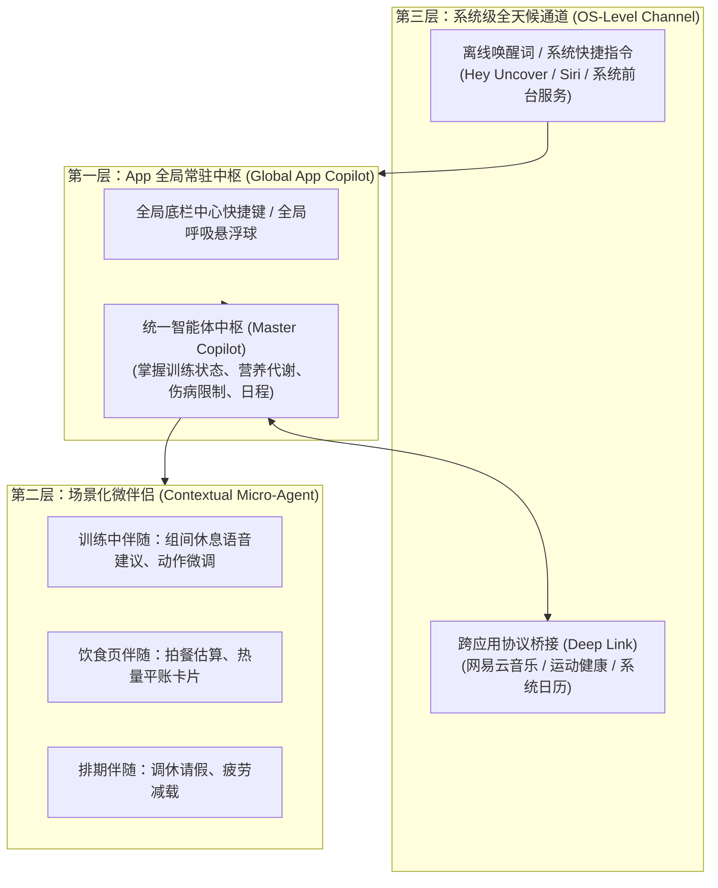
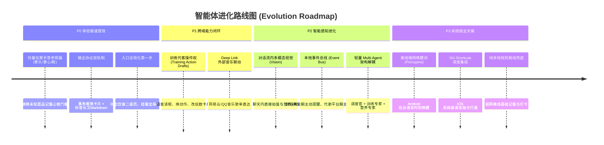

# 全域个人运动健康智能体（Personal S&C Copilot）
## 架构审计、系统级演进与优化全景规划报告

> **编制日期**：2026-10-02  
> **审计对象**：`calisthenics-app` 现有智能体架构（营养助手、训练快照、本地知识库与模型网关）  
> **文档定位**：全景技术架构审计、跨 App 系统级调用可行性方案与智能体演进规划  

> **2026-10-03 实施纠偏**：本文件为架构规划，不是已验证能力清单。网易云协议为待真机确认的候选，不能保证打开、加载歌单或起播；任意位置后台唤醒受系统与授权模型约束。用户已取消全部 50 字硬限制。当前实现、用户自带密钥和未完成的原生验收以 [实施说明](personal-agent-implementation-2026-10-03.md) 为准。

---

## 目录

1. [宏观定位重构：从“饮食页局部组件”到“全天候全域副驾”](#一-宏观定位重构从饮食页局部组件到全天候全域副驾)
2. [时刻语音唤醒与跨 App 生态联动（以网易云音乐为例）的技术真相](#二-时刻语音唤醒与跨-app-生态联动以网易云音乐为例的技术真相)
3. [当前智能体核心瓶颈与深层缺陷审计](#三-当前智能体核心瓶颈与深层缺陷审计)
4. [全域智能体演进路线图（P0 ~ P3 四阶段规划）](#四-全域智能体演进路线图p0--p3-四阶段规划)
5. [安全基线与防幻觉护栏守则](#五-安全基线与防幻觉护栏守则)

---

## 一、 宏观定位重构：从“饮食页局部组件”到“全天候全域副驾”

### 1. 现状痛点：认知错位与能力封印
在当前的系统实现中存在一个巨大的**架构张力（Architectural Tension）**：
* **能力底座已经是“全能私教”**：
  * 在 [NutritionAgentModal.tsx](file:///D:/001号仓库/calisthenics-app/src/components/nutrition/NutritionAgentModal.tsx#L37-L38) 与 [assistantTraining.ts](file:///D:/001号仓库/calisthenics-app/src/nutrition/assistantTraining.ts) 中，客户端已经为助手注入了完整的 `assistantTrainingSnapshot`：
    * 街头健身（六艺十式各阶段掌握阶数、训练周期进度）；
    * 器械训练（五分化 / PPL / 上下肢分化排期、可用器械设备、近 8 次真实完成的动作与有效组数）；
    * 体重 7 天滑动平均线与身体代谢缺口；
    * 服务端还挂载了《囚徒健身》全书知识与生理学解剖检索（[prisoner-knowledge.mjs](file:///D:/001号仓库/calisthenics-app/server/prisoner-knowledge.mjs)）。
* **交互入口却被封印在“厨房”**：
  * 该智能体被挂载在 `NutritionScreen.tsx` 饮食页的一个次级弹窗中。
  * **心理心智断层**：用户只有在要记一顿饭时才会点开它。当用户在大重量深蹲前心理建设、在单臂引体遇到力竭停滞、或者需要调整本周训练排期时，根本不会想到去打开“饮食页”寻找帮助。

### 2. 理想架构：三层全域智能体中枢

* **入口重构建议**：
  1. **全局主入口**：将智能体提升为底部导航栏居中的**核心交互键**，或全局屏幕边缘右侧的呼吸能量环；
  2. **感知上下文（Current Route Awareness）**：智能体打开时自动感知用户当前正停留在哪一页（如果在训练计时页，默认准备接收训练反馈；如果在饮食页，默认准备记餐）。

---

## 二、 时刻语音唤醒与跨 App 生态联动（以网易云音乐为例）的技术真相

### 1. 跨 App 联动：打开网易云音乐并播放指定歌单
> [!IMPORTANT]
> **结论：可采用系统 Deep Link 做候选入口，但需要逐平台、逐版本真机验证，不能保证商业级兼容或自动播放。**

#### 工业界标准方案：基于原生协议的 Deep Link / URL Scheme
不同音乐软件的协议、版本和官方支持情况需分别核实；系统存在 URL 处理器不等于目标 App 或播放成功。
* **网易云候选协议（未完成手机验证，不作为官方标准保证）**：
  * 打开指定歌单：`orpheus://playlist/{playlistId}`
  * `.../play` 的自动起播行为未经确认，当前不采用，也不承诺。
  * 搜索并播放歌曲：`orpheus://song/{songId}`

#### 智能体闭环工作流设计：
1. **意图解析**：用户在训练前语音说：*“准备推胸了，帮我放点燃的歌 / 播放我的硬核泵铁歌单”*；
2. **意图路由**：Agent 解析出 `Action: OPEN_EXTERNAL_APP`，识别目标服务 `netease_music`；
3. **知识库联动**：从用户的个人档案（[personalKnowledge.ts](file:///D:/001号仓库/calisthenics-app/src/nutrition/personalKnowledge.ts)）中读取用户预绑定的歌单 ID（或默认内置的官方训练能量歌单）；
4. **原生系统请求**：检测候选处理器，再请求打开歌单；无处理器时选择官方网页，失败时报告错误；
5. **验收闭环**：区分系统接受请求、正确打开 App、歌单加载与播放。当前只记录打开请求回执，不声称后三项已验证。

---

### 2. 随时语音唤醒（Always-on Voice Wake-up）的系统边界

用户期望随时随地（包括锁屏或在其他 App 界面时）呼唤“嘿，教练”唤醒 Agent。两个移动操作系统在此处存在严格的底层安全沙盒差异：

| 平台 | 实现可行性 | 落地工程方案 | 真实系统约束与边界 |
| :--- | :--- | :--- | :--- |
| **Android** | **极高** | 1. 集成轻量离线端侧唤醒词引擎（如 **Picovoice Porcupine**），CPU 占用 $<1\%$； 2. 开启系统前台保活服务（`Foreground Service`），附带常驻通知栏； 3. 检测到唤醒词后，直接弹出系统级悬浮浮窗（`System Alert Window Overlay`）。 | 国产定制 Android ROM（如小米澎湃OS、华为鸿蒙、OPPO ColorOS）具有激进的后台查杀策略，需引导用户在系统设置中开启“自启动”和“无限制电池优化”。 |
| **iOS** | **受系统沙盒保护** | **官方唯一正统途径**：接入 iOS 原生 **App Intents / SiriKit (Siri Shortcuts)**。 用户使用：“嘿 Siri，用 Uncover 开始练胸”或“嘿 Siri，让教练记录两个鸡蛋”。 | 苹果严格禁止第三方应用在后台无故常驻录音监听，私自挂载后台音频流上架 App Store 会被直接拒审封禁。因此 iOS 上必须依托苹果原生 Siri 进行系统级中转。 |

---

## 三、 当前智能体核心瓶颈与深层缺陷审计

经过对当前完整代码库的审查，该 Agent 若要真正胜任“运动健康全天候智能体”，在架构层面存在以下 **6 个实质缺陷**：

### 缺陷 1：执行不对称性——只读训练，只写饮食（Execution Asymmetry）
* **代码证据**：
  * 在 [NutritionAgentModal.tsx](file:///D:/001号仓库/calisthenics-app/src/components/nutrition/NutritionAgentModal.tsx#L104-L113) 中，Agent 拥有清晰的饮食写权限：
    * `kind: 'log_intake'`（记入饮食）；
    * `kind: 'set_preferences'`（修改宏量与偏好）；
    * `kind: 'meal'`（生成与替换餐单草案）。
  * **缺失**：它对训练模块完全是只读的！
* **业务硬伤**：
  * 当用户说：“我今天手腕挫伤，帮我把今天的双杠臂屈伸替换成下斜俯卧撑”，或者“这周六我要出差，帮我把周六的深蹲改到周日”。
  * 现在的 Agent 只能在文本里回复安慰你，**无法调用 `trainingPlans.ts` 或 `dailyEdits` 输出可确认的排期调整草案**。

---

### 缺陷 2：时间与生命周期感知断层（Temporal Unawareness & No Event Bus）
* **代码证据**：
  * 目前 Agent 仅在用户主动点击发送请求的瞬间，抓取一个静态的时间戳 `now = new Date()`。
* **业务硬伤**：
  * **缺乏主动事件总线（Event Bus）驱动**。
  * 用户刚刚在主界面完成了高强度的“推胸训练 8 组卧推”，主界面的这个事实改变，智能体**完全不知情**。它无法在用户打卡 30 分钟后主动弹窗：“刚完成高强度推力，建议在黄金窗口补充 30g 蛋白质与适量快碳”。
  * 处于 100% 被动响应状态，无法实现“伴随式私教”。

---

### 缺陷 3：单体巨石 Prompt 臃肿（Monolithic vs Multi-Agent）
* **代码证据**：
  * 服务端（`server/harness-v2.mjs` 和 `server/index.mjs`）使用单个巨大的 System Prompt 统揽全域：既要解析菜谱、算生熟比，又要懂街健六艺十式，还要核查器械疲劳和营养健康声明。
* **业务硬伤**：
  * 随着上下文和规则膨胀，大语言模型会出现**注意力稀释（Attention Dilution）**：容易顾此失彼，在处理复杂生理学提问时格式被卡死，在处理记餐时忽略了训练疲劳。
  * 缺乏多子智能体分工（Orchestrator 调度官 + 训练专家 + 营养代谢专家）。

---

### 缺陷 4：50 字符极简协议压制了“严肃运动哲学”的表达
* **代码证据**：
  * [validation.mjs](file:///D:/001号仓库/calisthenics-app/server/validation.mjs) 强制执行 `<= 50` 字符短文本校验。
* **业务硬伤**：
  * 对记餐、改偏好这种**事务型交互**，50 字符极简体验绝佳（干净利落不废话）；
  * 但当用户探讨**严肃运动人体科学**（如：“为什么我做单臂引体总卡在离心段？”或“生酮饮食与高碳增肌期对肌糖原和肌肥大有什么本质差异？”），模型被 50 字符强行截断，只能给出冰冷机械的套话，用户会觉得 Agent 缺少深度和灵魂。

---

### 缺陷 5：未知菜品估算缺乏生活化手势参照物（无秤估重门槛）
* **代码证据**：
  * [AssistantIntakeDraft.tsx](file:///D:/001号仓库/calisthenics-app/src/components/nutrition/AssistantIntakeDraft.tsx#L70) 中，菜品匹配成功后，克重输入框强制留白由用户输入。
* **业务硬伤**：
  * 这种设计在代码逻辑上严格杜绝了 AI 瞎猜，但**在现实餐馆场景中，用户根本不知道一盘盖浇饭到底是 300g 还是 550g**。面对空白的克重框，用户会产生极大的挫败感和记餐抗拒。

---

### 缺陷 6：弱网与离线环境下的优雅降级不足
* **代码证据**：
  * 一旦断网，请求打到云端失败，整个智能体直接抛出网络异常。
* **业务硬伤**：
  * 实际上，用户的精选食品库（`FOODS`）、本地 SQLite 个人档案、训练课表全都在手机本地。只因断网就彻底瘫痪是严重的单点依赖。

---

## 四、 全域智能体演进路线图（P0 ~ P3 四阶段规划）

### P0 阶段：低成本、极高收益的体验革新
1. **生活化手势份量估量器**：
   * 在 [AssistantIntakeDraft.tsx](file:///D:/001号仓库/calisthenics-app/src/components/nutrition/AssistantIntakeDraft.tsx) 克重输入框旁增加快捷估算弹层：
     * `单拳大小熟米饭 ≈ 150g`
     * `单掌心大小肉类 ≈ 100g`
     * `大拇指节油脂/坚果 ≈ 10g`
     * `中号家用饭碗 1 碗 ≈ 200g`
2. **意图输出双轨制（Dual-Track Output）**：
   * 事务型意图（记餐、改偏好、设置）：清晰简洁文本＋结构化卡片，不设置 50 字硬限制；
   * 咨询科普型意图（答疑、生理学）：放开限制，支持渲染排版考究、带有文献依据的专业 Markdown。
3. **全局常驻入口**：
   * 将 Agent 从饮食页弹窗中抽离，变成全局底栏常驻主键或悬浮交互组件。

### P1 阶段：跨域控制与生态打通
1. **训练代客操作卡片（Training Execution Drafts）**：
   * 拓展 `kind: 'training_adjustment'`，支持通过自然语言输出“换动作”、“改排期”、“标记减载”确认卡片，点击确认后修改主训练数据；
2. **网易云音乐 Deep Link 联动**：
   * 用户档案新增“训练歌单链接/ID”，Agent 匹配运动激情意图时自动通过 `orpheus://playlist/...` 拉起音乐。

### P2 阶段：多模态感知与主动伴随
1. **对话内拍照识餐（In-Chat Multimodal Vision）**：
   * 打通 [FoodCaptureCamera.tsx](file:///D:/001号仓库/calisthenics-app/src/components/nutrition/FoodCaptureCamera.tsx) 与助手输入栏，直接拍摄餐品送入多模态识别；
2. **本地事件总线驱动主动伴随**：
   * 训后 45 分钟营养窗口关怀、晚间宏量营养素平账建议、连续 14 天体重停滞主动归因。

### P3 阶段：系统级全天候与离线弹性
1. **端侧轻量离线唤醒词**：
   * Android 端引入 Porcupine 离线唤醒 + 悬浮窗；
   * iOS 端接入 Siri Shortcuts 意图路由；
2. **纯端侧规则引擎离线兜底**：
   * 地下室健身房断网时，依然支持本地查询食品、极简记餐与训练打卡。

---

## 五、 安全基线与防幻觉护栏守则

在任何版本的演进中，**以下在现有架构中已验证的核心护栏必须作为“红线”严格保留**：
1. **确定性营养计算**：永远严禁大语言模型凭空生成卡路里数值，必须由权威食品库（`FOODS`）基于配方食材加权确定性折算；
2. **无秤不猜成品重**：绝不在代码中预设“默认一碗=100g”的虚假假设；
3. **数据并发基线与幂等性校验（Proof of Basis）**：所有代客执行操作必须携带数据指纹，一旦宿主数据在生成期间发生变动，旧操作卡片立即安全熔断失效；
4. **外部脱敏沙箱**：发往搜索引擎或第三方的数据，永远只包含搜索关键词，严禁泄露个人体脂、病史与私密对话。
