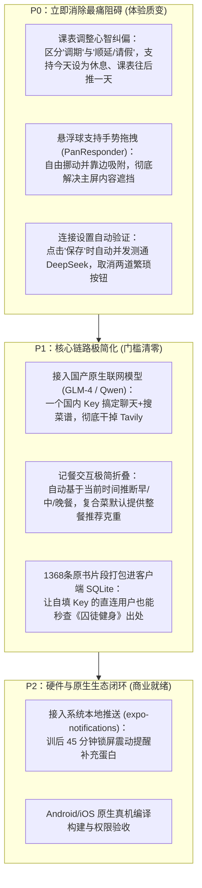

# 个人运动智能体（Personal S&C Copilot）
## 用户体验卡点、心智模型阻碍与未竟工作专项审计报告

> **审计基准**：2026-10-03 最新本地代码提交与功能实现  
> **审计视角**：**真实手持移动端的用户体验（User Experience）与操作摩擦力（Friction Points）**，抛开静态代码质量与单测通过率，聚焦用户在健身房、餐厅等生活场景中的真实阻碍与认知落差。  

---

## 目录

1. [执行摘要：从“代码逻辑完备”到“真实体验断层”](#一-执行摘要从代码逻辑完备到真实体验断层)
2. [真实使用场景下的 6 大致命体验卡点](#二-真实使用场景下的-6-大致命体验卡点)
   - [卡点 1：自填 Key 的操作门槛与海外搜索劝退](#1-自填-key-的操作门槛与海外搜索劝退小白第一步即流失)
   - [卡点 2：训练调期的心理预期与系统逻辑冲突](#2-训练调期的心理预期与系统逻辑冲突我只是想休息为什么把练腿换到今天)
   - [卡点 3：网易云音乐切歌的“伪自动化”与打断感](#3-网易云音乐切歌的伪自动化与打断感无法静默起播跳出后回不来)
   - [卡点 4：未知菜品记餐步骤冗长与心智折磨](#4-未知菜品记餐步骤冗长与心智折磨说了句话还要点四五次屏)
   - [卡点 5：全局悬浮 AI 按钮的物理遮挡与不可拖拽](#5-全局悬浮-ai-按钮的物理遮挡与不可拖拽挡住操作又移不开)
   - [卡点 6：地下室健身房断网时的“秒变砖”](#6-地下室健身房断网时的秒变砖离线正则过于狭窄)
3. [当前代码中“尚未做完 / 处于半成品状态”的工作清查](#三-当前代码中尚未做完--处于半成品状态的工作清查)
4. [破除体验卡点的优先级迭代建议（P0 ~ P2）](#四-破除体验卡点的优先级迭代建议p0--p2)

---

## 一、 执行摘要：从“代码逻辑完备”到“真实体验断层”

在近期的演进中，开发团队交付了一套在工程防御性、数据一致性（Non-destructive Overlay）、单元测试（575 项全过）和安全性（SecureStore 密钥隔离）上极高水准的代码底座。

然而，**“逻辑严密的代码”不等于“顺畅好用的产品”**。当剥离纯技术的开发者视角，模拟一个在健身房浑身是汗、握着手机准备深蹲，或者在餐馆急着记一顿便饭的真实用户时，我们发现了大量令人烦躁的**心智冲突、多余点击与交互死胡同**。

---

## 二、 真实使用场景下的 6 大致命体验卡点

### 1. 自填 Key 的操作门槛与海外搜索劝退（小白第一步即流失）

* **涉及组件**：[ConnectionSettings.tsx](file:///D:/001号仓库/calisthenics-app/src/agent/ConnectionSettings.tsx)
* **用户真实遭遇**：
  1. **概念认知盲区**：普通健身用户不知道什么是 API Key，看到一串 `sk-xxxx` 的输入框往往不知所措。
  2. **繁重的跨 App 操作**：
     * 用户点击链接进入 DeepSeek 官网 $\rightarrow$ 手机浏览器打开桌面端控制台 $\rightarrow$ 注册、绑定手机、支付宝充值 $\rightarrow$ 找到 API Keys 页面生成密钥 $\rightarrow$ 复制这串 30 几位的字符；
     * **手机内存被杀惨剧**：在许多国产 6G/8G 内存手机上，用户从 App 切到浏览器充值再切回来，**原 App 已经被系统清理杀死重启**，用户刚进入的设置界面被冲掉，挫败感极强。
  3. **Tavily 是完全不可逾越的海外壁垒**：
     * Tavily 页面全英文，需要 Google 账号或海外信用卡绑定。国内普通用户想要记一碗拉面，看到还要去配置一个英文的 Tavily 密钥，99% 的用户会直接放弃联网功能。
  4. **“先保存，再测试”的多余交互**：
     * 界面写着：“先保存再测试。点击测试会发起一次请求”。用户必须手动点【保存连接设置】，再手动点【测试 DeepSeek 连接】。
     * **用户直觉**：为什么点保存时不能自动测一下？多这一步点击毫无意义，且一旦用户忘了点测试，到了实际聊天报错时才发现 Key 输错了。

---

### 2. 训练调期的心理预期与系统逻辑冲突（“我只是想休息，为什么把练腿换到今天？”）

* **涉及组件**：[trainingActions.ts#L43](file:///D:/001号仓库/calisthenics-app/src/agent/trainingActions.ts#L43) (`operation: 'reschedule'`)
* **用户真实遭遇**：
  * **用户诉求**：周五下班非常疲惫，对助手说：“今天太累了，把今天的训练改到明天”。
  * **用户的自然心理预期**：“我今天不练了，今天变休息，本周课表顺延”。
  * **系统的实际运行逻辑**：代码底层执行的是**严格的两日对称配对交换（Paired Swap）**——将周五与周六的课程对调。
  * **灾难性体感**：
    * 周六原本安排的是最硬核的【大重量深蹲日】；
    * 对调后，周五今天直接变成了【大重量深蹲日】，周六变成了原本的推胸日；
    * 用户打开今天界面一看：“我本来就是因为累才推迟，你居然把最累的练腿挪到今天让我练？！”
  * **结论**：数学上的“对调”完全违背了人类语言中“推迟/请假一天”的生物生理学本意。

---

### 3. 网易云音乐切歌的“伪自动化”与打断感（无法静默起播，跳出后回不来）

* **涉及组件**：[music.ts](file:///D:/001号仓库/calisthenics-app/src/agent/music.ts) & [NutritionAgentModal.tsx#L237](file:///D:/001号仓库/calisthenics-app/src/components/nutrition/NutritionAgentModal.tsx#L237)
* **用户真实遭遇**：
  * **用户诉求**：戴着耳机站在杠铃前，语音喊一句：“帮我播放训练歌单”。
  * **实际发生的打断链条**：
    1. **必须伸手再点一次**：助手不是直接放歌，而是弹出卡片，必须手动点一下【确认打开】；
    2. **粗暴跳出 App**：手机界面瞬间从健身 App 弹走，强制跳转到网易云音乐；
    3. **广告与无法自动播放**：国内音乐 App 在拉起时大概率会弹出 3~5 秒开屏广告；广告过后停留在歌单主页，**根本不会自动起播**，用户还得在网易云里点一下【播放全部】；
    4. **回不来了**：放好音乐后，用户发现自己被困在网易云里，必须手动划出任务后台切回健身 App 才能看今天练几组。
  * **用户感受**：这还不如直接在手机下拉菜单控制中心按一下播放键，叫 AI 反而多花了 10 秒钟和好几次手动操作。

---

### 4. 未知菜品记餐步骤冗长与心智折磨（说了句话还要点四五次屏）

* **涉及组件**：[AssistantIntakeDraft.tsx](file:///D:/001号仓库/calisthenics-app/src/components/nutrition/AssistantIntakeDraft.tsx)
* **用户真实遭遇**：
  * **用户诉求**：在快餐店吃了一份“黄焖鸡米饭”，想快速记下来。
  * **实际步骤消耗**：
    1. 没配 Tavily Key 时，直接报错“未配置 Tavily，这次没有使用网络资料”，流程当场死锁；
    2. 即使搜索到了候选配方，用户必须经历漫长的点击流水线：
       * 点击【是这道菜 · 填写吃下的份量】；
       * 面对空白的克重框发呆（虽然有一拳米饭 150g 按钮，但黄焖鸡是“汤汁+鸡腿+土豆+米饭”混合外卖，用户依然不知道整份到底算多少克）；
       * 填了克重后，还必须手动下滑屏幕，单选【午餐】；
       * 最后再点击一次【确认记入这一餐】。
  * **用户感受**：本来期望“一句话记完”，结果在手机上又是确认菜谱、又是猜克重、又是选餐次，点了四五次屏幕，比直接打字搜索还要繁琐。

---

### 5. 全局悬浮 AI 按钮的物理遮挡与不可拖拽（挡住操作又移不开）

* **涉及组件**：[PersonalAgentHost.tsx#L47-L55](file:///D:/001号仓库/calisthenics-app/src/agent/PersonalAgentHost.tsx#L47-L55)
* **用户真实遭遇**：
  1. 悬浮球被写死在屏幕右下角：`position: absolute, right: 16, bottom: 172`；
  2. 当“主动关怀卡片”触发时，弹出框直接霸占右下角大片区域（`bottom: 232, maxWidth: 270`）；
  3. **无法拖拽避让**：在器械训练日详情页、跑步记录页等长列表界面，屏幕右下角通常是关键动作组数勾选框或滚动查看区域。用户发现悬浮球把底下的文字或按钮死死挡住，用手指拖它毫无反应（不支持 PanResponder），形成极其恼人的视觉死角。

---

### 6. 地下室健身房断网时的“秒变砖”（离线正则过于狭窄）

* **涉及组件**：[offline.ts#L6](file:///D:/001号仓库/calisthenics-app/src/agent/offline.ts#L6)
* **用户真实遭遇**：
  * 真实的专业铁馆、重型健身房往往位于商场地下一层或地下二层，手机经常出现仅有 1 格信号或无网络；
  * 用户在地下室想记个动作或记个加餐，口语化地说：“今天卧推推了 100 公斤 4 组”，或者“午饭吃了鸡胸肉和两根香蕉”；
  * **实际反应**：离线引擎只认极度严苛的单品单句模板，稍微多报一样食物或口语稍有变化，离线匹配全部落空，直接冷冰冰弹出“网络无法连接”，助手在用户最专注训练的场景下当场瘫痪。

---

## 三、 当前代码中“尚未做完 / 处于半成品状态”的工作清查

经过对仓库代码、原生目录与文档记录的全面比对，目前系统中客观存在以下 **7 项处于半成品、Mock 模拟或未真正打通闭环的工作**：

| 模块名称 | 当前代码实际状态 | 离真正跑通还缺什么？ |
| :--- | :--- | :--- |
| **1. 离线原书知识库 (BYOK RAG)** | **已阻断 (Disabled)** | 在 Render 模式下有 1368 条原书片段；但在**“个人密钥直连”模式下被强制关闭**（`knowledgeUnavailable = true`）。尚未将知识库打包进手机本地 SQLite，直连用户完全查不到《囚徒健身》精准行号出处。 |
| **2. 随时语音唤醒 (Porcupine)** | **空壳状态 (Non-functional)** | 原生 Android 编写了 `CopilotWakeService.kt` 服务，但**代码库中没有授权的 `.ppn` 唤醒模型文件和 Picovoice AccessKey**。在手机端界面上，该功能处于灰色的“模型不可用”状态，无法实现锁屏或后台语音呼唤。 |
| **3. 原生安装包编译 (Native Build)** | **未编译验证 (Uncompiled)** | 仅完成了 JavaScript/Hermes 导出以及 Kotlin/Swift 源码编写。**尚未在配置了完整 Android NDK/JDK 或 macOS Xcode 的环境下进行真实 APK/IPA 编译**，原生插件在真机后台的保活能力、麦克风争用和系统权限弹窗仍未经过硬件级验收。 |
| **4. 自带联网大模型替代方案** | **尚未落地 (Pending)** | 联网搜索目前**完全锁死在 Tavily 单一通道**上。尚未支持通义千问（`enable_search: true`）或智谱（GLM-4 `web_search`）等原生自带免配置搜索的国产模型。 |
| **5. 主动关怀系统本地推送** | **局限在 App 前台 (In-app only)** | 现有的训后关怀与晚间回顾完全基于 App 内部的定时器轮询（`setInterval(refresh, 30000)`）。如果用户练完锁屏把手机塞回口袋，**App 无法在系统通知栏发出本地震动推送（Local Push Notification）**。 |
| **6. 多模态拍餐行内渲染** | **仍为外挂弹窗 (Modal-only)** | 点击“拍餐”依然是呼出原有的全屏相机 Modal 并跳入老式编辑器，尚未实现将拍照缩略图直接作为一条消息气泡插入当前聊天流中。 |
| **7. 原生构建依赖安全审计** | **存在告警 (Vulnerabilities)** | `npm audit` 报告 13 个依赖安全告警（8 moderate、5 high），涉及 Expo 依赖链中的 `node-forge`、`uuid`、`xcode` 等包，需在版本升级时进一步排查兼容性。 |

---

## 四、 破除体验卡点的优先级迭代建议（P0 ~ P2）

为彻底消除用户的阻碍感，建议后续不要再铺大摊子，集中力量对真实使用瓶颈进行**外科手术式的体验修复**：

---

### 核心结论

当前这套 Agent 的**代码内核是扎实、安全且极度防越权的**。它目前面临的所有问题，**不是代码写得不好，而是站在真实用户的视角下，交互链路太长、假设太理想化、心智模型出现了偏差**。

只要针对“课表推迟逻辑”、“悬浮球遮挡”和“国产免配置联网”完成这三项体验收口，这款智能体的实际体感就将从“一个严谨的极客工具”真正跃升为“一个随叫随到、贴心顺手的高级私教伴侣”。

## 五、2026-10-03 第二轮落地状态

上述内容是审计时的状态，不作为当前验收结论。最新实装与测试见 [本地实现与验收说明](personal-agent-implementation-2026-10-03.md)。

- P0 已实现：顺延与显式交换分离；拖动吸附并保存位置；默认保存并验证，提前说明费用，保留仅保存；申请密钥后恢复设置页。
- P1 已实现：智谱同一 Key 调用官方聊天与独立搜索；折叠且可编辑的餐次建议、保留用户克重、无搜索时食材拆分、多食品离线解析；照片聊天回显。智谱当前文字模型不能识别图片；真实账号与手机网络尚未验证。
- 未采用“复合菜静默默认重量”或“45 分钟必须补蛋白”的强制逻辑；没有把原书全文／图片未经许可打进公开知识库，也未认定某平台注册必须有海外银行卡。
- 尚未完成：私人原书本机导入、关闭 App 后的本地通知、完整口述训练记录、全内联相机、授权唤醒资源与原生真机验收。音乐不保证自动播放。
- 583 项回归通过，Android JS 导出通过，不等于已发布安装包。依赖审计最新一次返回 24 条告警（7 moderate、17 high），原文“13 条”不能继续当作当前数字；不以危险降级消除报告数字。
